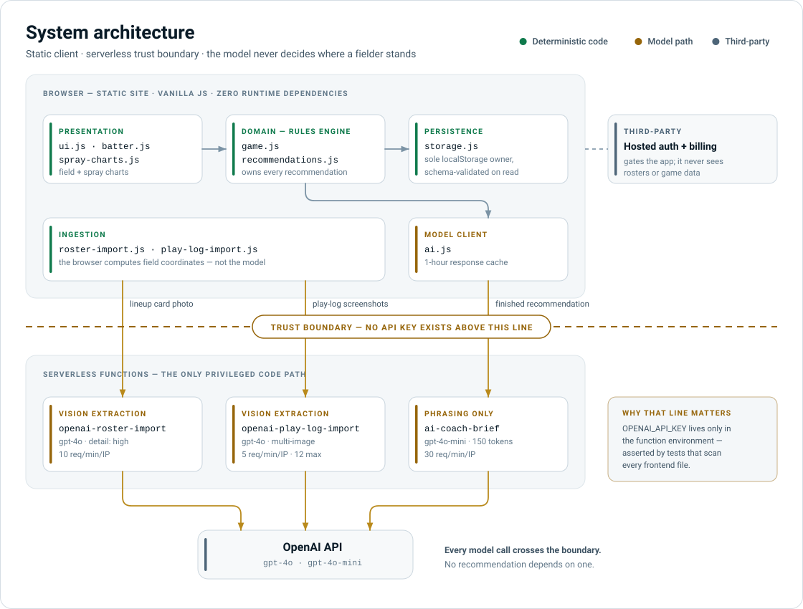
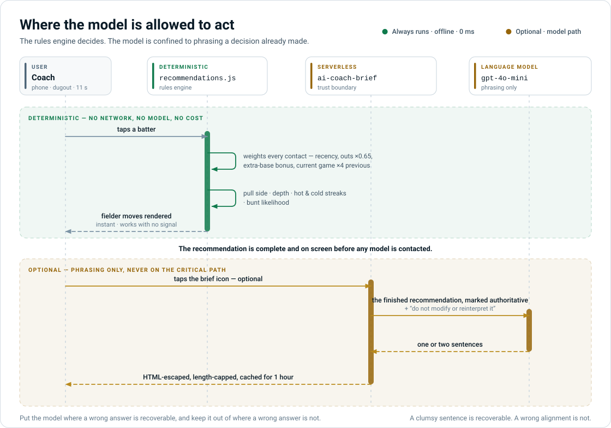
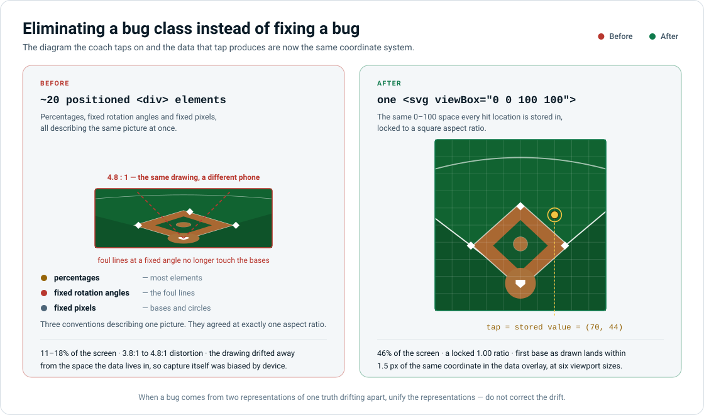
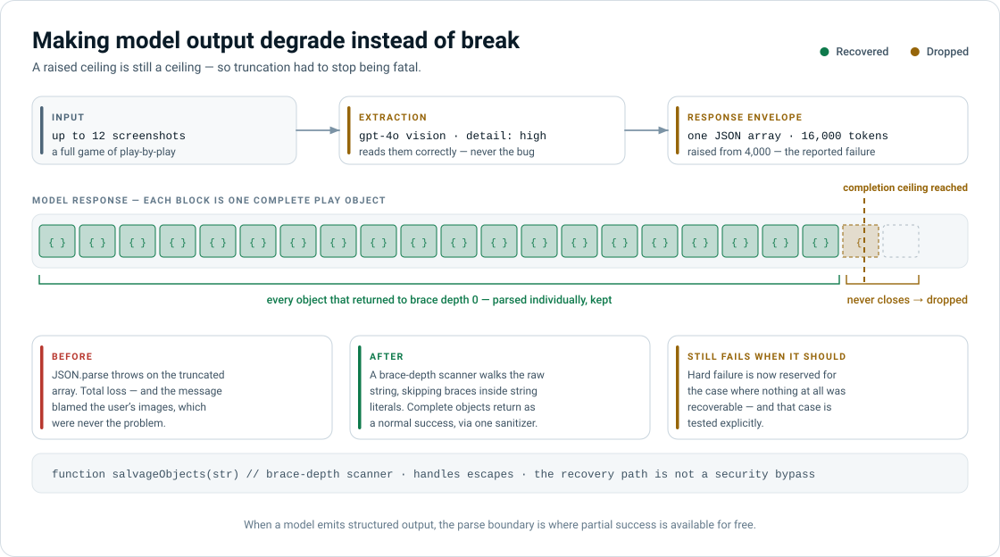

# Defensive Positioning Assistant — Architecture Case Study

A production application that tells a baseball coach where to move each fielder, computed from where the batter at the plate has actually hit the ball. It runs on a phone, in a dugout, between innings, on rural cell service.

This document is about the decisions, not the features. Feature documentation is in [README.md](README.md).

---

## Executive summary

| | |
|---|---|
| **Problem** | Defensive positioning below the professional level is guesswork. The data that would inform it exists only as a coach's memory or as screenshots in a scorekeeping app, and there is no time during a game to consult either. |
| **Constraint** | The decision must be delivered in under ten seconds, one-handed, on a phone, on bad connectivity, to a user who is not technical and is being watched by twenty people. |
| **Architecture** | Deterministic rules engine owns every recommendation. A language model is confined to phrasing that recommendation in a sentence a coach can say out loud. Every model call crosses a serverless trust boundary; no key is ever in the client. |
| **Central decision** | The model does not decide. It explains. A recommendation a coach acts on in front of a crowd has to be reproducible and defensible, and a model that can quietly disagree with the rules engine makes it neither. |
| **Outcome** | 381 automated tests across 15 files. Zero runtime dependencies. Three serverless functions, seven distinct failure codes. The field diagram went from 11–18% of the screen at a 4.8:1 distortion to 46% at a locked 1.00 ratio. A model-output failure that broke imports at seven screenshots now degrades to partial success instead of an error. |

---

## 1. The problem

Professional teams position defenses from tracked spray data. Below that level — high school, travel ball, youth — the same decision gets made from a coach's gut, and it is one of the highest-leverage decisions available. A fielder standing fifteen feet in the right place converts a hit into an out.

The data actually exists. Coaches watch every at-bat, and many keep a season of play-by-play logs in a third-party scorekeeping app. But it exists in a form nobody can use in the eleven seconds between a batter stepping in and the first pitch:

- **In someone's head.** Unreliable, unshareable, and gone when the assistant coach leaves.
- **In a scorekeeping app.** Structured, but as a text log with no spatial dimension and no positioning output.
- **On paper spray charts.** Spatial, but manual, and nobody re-draws them mid-game.

The gap is not analysis. It is **an analysis that arrives fast enough to act on**, in language that can be shouted across a field.

That framing dictated everything downstream. This is not a dashboard problem. It is a latency-and-legibility problem that happens to have analytics inside it.

---

## 2. Constraints that drove the architecture

These are the real conditions of use. Each one eliminated an otherwise reasonable design.

| Constraint | Where it came from | What it ruled out |
|---|---|---|
| Used on a phone held in one hand, outdoors, in sunlight | Coaches are also managing a game | Dense dashboards; anything requiring two hands or precise taps |
| Must be readable and actionable in under ten seconds | The interval between batters | Multi-screen flows; anything the coach has to scroll to reach |
| Connectivity is unreliable at rural fields | Ballparks are not offices | Framework bundles; server round-trips on the critical path; a client-side database that syncs |
| The recommendation gets relayed verbatim to a twelve-year-old | It is spoken out loud, immediately | Probability distributions; hedged output; anything requiring interpretation |
| One operator, near-zero fixed cost | Small commercial product | Always-on servers; anything with idle cost |
| Non-technical user, zero training | Coaches, not analysts | Configuration; setup wizards; error messages that name internals |

The **no-scroll requirement** is the sharpest of these, and it is worth stating as an architect would: it converts a UI preference into a hard system invariant. Everything from the top bar to the analysis button must be simultaneously visible on the shortest phone in circulation. That invariant is enforced in CSS, asserted in end-to-end tests at six viewport sizes, and it is the reason two separate layout rewrites appear in the decision log.

---

## 3. System architecture

<picture>
  <source media="(prefers-color-scheme: dark)" srcset="docs/diagrams/architecture-dark.svg">
  
</picture>

Three properties are load-bearing:

**The client is static and dependency-free.** Twelve modules with an explicit load order, roughly 300 KB uncompressed for the entire application, and no npm package in the shipped path. A coach on one bar of service downloads a handful of files.

**The trust boundary is the function layer, and it is the only one.** `OPENAI_API_KEY` exists in the function environment and nowhere else. Integration tests scan every frontend file to assert no secret ever appears there, so this is a property the build enforces rather than a habit the author maintains.

**`storage.js` is the sole owner of persistence.** One module reads and writes localStorage, and it validates the schema on every read — rejecting non-objects, stripping prototype-pollution keys, and coercing each field to its expected type. Browser storage is user-writable, which makes it untrusted input in exactly the way a request body is.

---

## 4. The decision that defines the system: the model does not decide

This is the question every AI application answers, usually implicitly. Here it was answered deliberately and the answer is narrow.

<picture>
  <source media="(prefers-color-scheme: dark)" srcset="docs/diagrams/model-boundary-dark.svg">
  
</picture>

**The rules engine produces the recommendation. The model receives it as a finished, authoritative input and is instructed only to phrase it.** The prompt labels the recommendation block *authoritative* and forbids reinterpretation. The model's output is escaped and length-capped before it can touch the DOM.

**The alternative I rejected:** send the raw contact history to the model and let it produce the positioning directly. It is less code, it demos better, and it is what most projects in this space do.

It fails on four counts that matter for this specific use:

1. **Reproducibility.** The same batter with the same history must produce the same call every time. A coach who gets a different answer on a second look stops trusting the tool, and trust is the entire product.
2. **Explainability.** When a coach asks *why*, the answer has to be a number — "68% of his contact is to the right side." Not a paraphrase of a model's reasoning.
3. **Latency and availability.** The rules engine renders instantly and works with no signal. Model latency on the critical path would break the ten-second budget at precisely the moment it matters.
4. **Cost.** Recommendations are computed constantly as the coach steps through a lineup. Only the optional explanation costs money.

The general principle, and the one I would defend in a design review: **put the model where a wrong answer is recoverable, and keep it out of where a wrong answer is not.** A clumsy sentence is recoverable — the coach reads the numbers instead. A silently wrong defensive alignment is not; it is a hit that should have been an out, and nobody can tell it happened.

The same logic governs the two extraction features. The model does the one thing it is genuinely better at than any code I could write — reading a handwritten lineup card or a dense log screenshot into structured fields — and hands back structured data. **The browser, not the model, computes the field coordinates from those fields.** The model reports *"ground ball to shortstop."* Deterministic code decides where in the 0–100 coordinate space that plots. Extraction is a model problem; geometry is not.

---

## 5. Decision log with rejected alternatives

Six decisions where a reasonable architect could have gone the other way. The full log, with dates, is in [DECISIONS.md](DECISIONS.md).

### 5.1 Static site over a backend

**Chose:** Static hosting plus serverless functions. **Rejected:** a small application server.

A server would have simplified sessions, allowed shared team data, and made rate limiting stateful and correct across instances. It costs money at idle, needs patching, and is a second thing to be down at 7 p.m. on a Saturday. For a single-operator product where each coach's data is genuinely private to that coach, the serverless split gives the security boundary without the operational surface.

**What it costs, stated honestly:** rate limiting is in-memory per function instance, so it degrades under concurrent cold starts. It is an abuse speed bump, not a quota system. At this product's scale that is the right trade; at ten thousand users it is the first thing I would move to shared state.

### 5.2 Per-task model selection

**Chose:** `gpt-4o` for vision extraction, `gpt-4o-mini` capped at 150 output tokens for the brief. **Rejected:** one model everywhere.

The brief is the frequently-called path and is a phrasing task with the analysis already done — the cheap model is not a compromise there, it is correct sizing. Vision extraction is the hard task, reading a handwritten lineup card or a dense log screenshot, and gets the capable model at `detail: high`. **Cost follows task difficulty rather than a single global choice**, and the expensive path is the rare one: extraction runs a handful of times per season, while the brief is available on every batter.

### 5.3 Client-side cache with a TTL

**Chose:** Five most recent briefs, one-hour TTL, in localStorage. **Rejected:** no cache; or a server cache.

Coaches revisit the same batter repeatedly in one game. Repeat views cost nothing and return instantly. The one-hour TTL exists because the underlying data changes as the game progresses — an unbounded cache would confidently serve a stale read, which is worse than no cache at all. Five entries is roughly the number of batters a coach cycles through in an inning.

### 5.4 CSP retains `unsafe-inline` for scripts

**Chose:** ship the security headers with a documented gap. **Rejected:** delay hardening until a full refactor removes the inline handlers.

The page carries sixty-plus inline event handlers inherited from the original prototype. Removing them is a large, risky, behavior-preserving refactor of working game logic. The policy still constrains external script sources, frames, objects, and `base-uri`, which blocks the realistic attack paths for a static site with no user-generated content.

**I recorded this as a known gap rather than quietly shipping it,** which is the part I would actually defend. An honest documented weakness is an engineering artifact. An undocumented one is a liability.

### 5.5 Unmatched imported plays are dropped, not queued

**Chose:** silently discard any play that does not confidently match a roster player. **Rejected:** an "unknown player" bucket with a review UI.

The reconciliation UI is the obvious feature and it is a trap: it is the largest piece of UI in the feature, it is used on a laptop rather than in a dugout, and it exists to serve the model's uncertainty rather than the coach's need. Dropping unmatched plays means an import is either correct or incomplete — never wrong. **For a tool whose output gets acted on immediately, incomplete beats wrong**, and the coach can chart the missing at-bats manually in seconds.

### 5.6 The field diagram is one SVG in the data's coordinate space

**Chose:** a single inline `<svg viewBox="0 0 100 100">`, locked square. **Rejected:** keeping the twenty positioned `div` elements it started as.

This is the most transferable decision in the project, so it gets its own section.

---

## 6. Eliminating a bug class instead of fixing a bug

<picture>
  <source media="(prefers-color-scheme: dark)" srcset="docs/diagrams/coordinate-space-dark.svg">
  
</picture>

**The symptom, reported from real use:** on some phones the base lines visibly drifted relative to the bases. The diamond stopped looking like a diamond.

**The cause:** the field was drawn as roughly twenty positioned elements using *three different coordinate conventions at once* — percentages for most elements, fixed rotation angles for the foul lines, fixed pixels for the bases and circles. They agreed at exactly one aspect ratio. Every other viewport pulled them apart.

**Why it was serious rather than cosmetic.** Hit locations are stored as normalized `x`/`y` in a 0–100 space, and every downstream calculation — pull side, depth, and the point-in-polygon test that assigns a ball to a fielder's zone — runs purely on those numbers. **The analysis was never corrupted.** But the picture the coach taps on had drifted away from the coordinate space the data lives in. So the drawing misrepresented stored data, and worse, *capture was biased*: a coach tapping "where the ball landed" was tapping a diagram that sat differently on their phone than on another.

That is a data-integrity bug wearing a CSS bug's clothing, and it is the kind that never announces itself.

**The fix was not to correct the offsets.** Correcting them produces a drawing that is right today and drifts again the next time the layout changes. Instead, the entire background was rebuilt as one SVG with `viewBox="0 0 100 100"` — **the same 0–100 space the data is stored in** — and the field locked to a square aspect ratio. Position tags, hit markers, and the tap handler stay as overlays in that same space.

Now the drawing and the data cannot disagree, because they are the same coordinate system. The end-to-end test asserts it numerically: first base as drawn by the SVG lands within 1.5 pixels of where the data overlay places the identical coordinate, at every tested viewport.

**The principle:** when a bug comes from two representations of the same truth drifting apart, unify the representations. Fixing the drift treats the symptom; removing the second representation makes the entire class of bug unrepresentable. Those are different guarantees, and only one of them survives the next change.

---

## 7. Failure engineering: making model output degrade instead of break

<picture>
  <source media="(prefers-color-scheme: dark)" srcset="docs/diagrams/truncation-recovery-dark.svg">
  
</picture>

**The report:** importing seven or more play-log screenshots failed with *"Could not read plays from the screenshots. Try clearer images."* Six worked. The images were fine.

**The diagnosis.** There was no seven-screenshot limit anywhere in the code — the configured maximum was twelve. Seven was an *emergent* threshold. The function requested extraction with a 4,000-token completion ceiling. Around seven screenshots' worth of plays, the model's JSON array exceeded it, the response was cut off mid-object, `JSON.parse` threw, and the catch block returned a generic content error.

**The error message was actively harmful.** It blamed the user's images for a problem in the response envelope, sending them off to re-photograph screenshots that were never the issue. A misdirecting error costs more than a crash, because it spends the user's time on the wrong thing.

**Two fixes. One is bookkeeping; the other is the point.**

Raising the ceiling to 16,000 tokens — just under the model's documented completion cap — resolves the reported case. That is bookkeeping.

The fix that matters is recognizing that **a raised ceiling is still a ceiling.** Someone will eventually import twelve screenshots of a fourteen-inning game. Truncation had to stop being fatal:

```js
// Fallback when JSON.parse throws on a truncated array.
// Every object up to the last complete brace is still valid data.
function salvageObjects(str) { /* brace-depth scanner */ }
```

The salvage pass walks the raw string tracking brace depth, correctly ignoring braces inside string literals and handling backslash escapes so an escaped quote cannot desynchronize it. Each return to depth zero is a complete, balanced top-level object, parsed individually and kept; one that fails to parse is skipped rather than aborting the pass. The dangling object at the truncation point never returns to depth zero and is dropped naturally. Salvaged objects flow through the same sanitizer as normal ones — the recovery path is not a security bypass.

**Result:** a truncated response returns the plays that were fully generated, as a normal success. Hard failure is now reserved for the case where nothing at all was recoverable, and that case is tested explicitly.

**The general lesson:** when a model emits structured output, the parse boundary is where partial success is available for free. Treating it as all-or-nothing throws away work the user already paid for, in tokens and in time. This generalizes past this application — any system that parses generated JSON has the same recovery available and usually does not take it.

### Failure handling across the three functions

| Concern | Handling |
|---|---|
| Key exposure | Key exists only in the function environment. Asserted by tests that scan every frontend file. |
| Abuse | Per-IP rate limits scaled to call cost: 30/min for the cheap text brief, 10/min for single-image import, 5/min for multi-image import. |
| Payload size | ~5 MB per image before base64 overhead, hard cap of 12 images, both rejected with `413` rather than a generic `500`. |
| Prompt injection | The brief's system prompt treats all supplied context strictly as scouting data and never as instructions — relevant because that context contains user-entered player names. |
| Output injection | Every model-returned field is HTML-escaped and length-capped before reaching the DOM. |
| Failure granularity | Seven distinct status codes: method, rate limit, missing key, bad input, oversized input, upstream failure, unparseable output. The client can always tell the user something true. |
| Untrusted local state | localStorage is schema-validated on read, with prototype-pollution keys stripped. |

The theme: **the number of distinct failure codes is a design decision, not an implementation detail.** Every collapsed error is a user sent to debug the wrong thing, which is exactly how the seven-screenshot bug wasted the coach's time.

---

## 8. Results

All engineering figures below are verifiable from this repository; the commands are in §10.

### Measured outcomes

| Metric | Before | After |
|---|---|---|
| Field diagram, share of screen (360–414 px phones) | 11–18% | **46%**, full screen width |
| Field aspect ratio distortion | 3.8:1 to 4.8:1 | **1.00**, locked square, all six tested viewports |
| Drawing-to-data alignment | Drifted with viewport | **Within 1.5 px**, asserted in test |
| Play-log import ceiling | Hard failure at ~7 screenshots | **12 screenshots**, partial recovery past the model's token limit |
| Import failure mode | Total loss with a misleading message | **Partial success**; hard failure only when nothing is recoverable |
| Controls reachable without scrolling | Failed on short phones | **Zero scroll** on all six tested viewports, buttons clear of the footer |

### System characteristics

| | |
|---|---|
| Automated tests | **381**, across 15 files, all passing |
| Test-to-source ratio | ~4,200 test lines against ~3,100 lines of JavaScript — **1.34:1** |
| Runtime dependencies | **Zero.** Two dev dependencies (Vitest, Playwright). |
| Total client payload | ~300 KB uncompressed, entire application |
| Secrets reachable from the client | **Zero**, enforced by test |
| Serverless functions | 3, each with input validation, rate limiting, and output sanitization |
| Distinct error codes | 7 |
| Recommendation latency | Instant and offline-capable — no model call on the critical path |
| Marginal cost per recommendation | **$0.** Only the optional explanation calls a model, and it is cached for an hour. |

### Unit economics

The cost architecture is worth stating plainly because it was designed rather than discovered:

- **Positioning recommendations cost nothing per use.** They are deterministic client-side computation.
- **The optional brief** uses the cheap model, capped at 150 output tokens, cached for an hour, and only fires when a coach asks.
- **Vision extraction is the only expensive call**, and it is bounded twice: 5 requests per minute per IP, and 12 images per request.
- **Hosting has no idle cost.** A month with no games costs nothing to serve.

The pattern that generalizes: **the frequent path is free and the expensive path is optional, rate-limited, and cached.** Most of this application's value is delivered by code that never contacts a model.

### What I deliberately did not measure

Stating this is part of the case study, not a caveat on it.

I have **no measurement of on-field positioning accuracy.** Doing it properly requires labeled ground truth — where the fielders actually stood, where the ball actually went, and the counterfactual outcome — across enough plate appearances to be significant. That data does not exist at this level of baseball, which is the reason the product exists at all.

I could have generated a number. Simulating from the recorded contact data would measure the rules engine against its own inputs and prove only that the arithmetic is consistent. I would rather present a system with an honest evaluation gap than a metric that does not mean what it appears to mean.

**What would close it:** instrument accepted-versus-ignored recommendations, then compare balls-in-play outcomes on at-bats where the alignment was taken against those where it was not. That is a season of instrumented use and a real experimental design, and it is the first thing I would build with access to a cooperating team.

---

## 9. What I would do differently

**Build the coordinate space first.** The field drawing and the hit data should have shared one coordinate system from the first commit. Retrofitting it was two rewrites, and in between, the tool was quietly biasing its own data capture. When a system has a spatial model, that model is architecture and belongs in the first design pass — not in CSS.

**Set the response envelope from the worst case, not the typical one.** The 4,000-token ceiling was sized for a normal import. The correct question at design time is *what does the largest legitimate input produce*, and then: *what happens when it exceeds that anyway.* The second question is the one that produced the salvage path, and it should not have taken a field report to ask it.

**Rate limiting will not survive scale.** In-memory per-instance counters are the right call for a single-operator product and the wrong one past a few hundred concurrent users. It is a documented, deliberate ceiling rather than an oversight — but it is a ceiling, and I would move it to shared state before growth, not during it.

**Retire the inline handlers.** Sixty-plus inline `onclick` attributes are the single largest constraint on the security policy. The refactor is mechanical, testable behavior-for-behavior against the existing suite, and it would let the CSP drop `unsafe-inline` entirely.

### What I would build next

- **A confidence gate on the recommendation.** The engine already suppresses movement calls below a 45% pull threshold. That threshold is a constant chosen by judgment; with enough charted data it should be derived, and the sample size behind each call should be surfaced to the coach.
- **Shared team data.** Currently each coach's data is local to their device — private and offline-capable by design, but an assistant coach charting from the third-base line cannot contribute to the same game. This is the highest-value feature and the one that most changes the architecture, which is exactly why it has not been done casually.
- **Instrumented outcome tracking**, per §8, to close the evaluation gap.

---

## 10. Verifying the claims in this document

Every engineering figure here is checkable in a few minutes:

```bash
npm install
npx vitest run          # 381 tests, 15 files
npm run test:e2e        # requires a browser; some specs need network access
```

| Claim | Where to check |
|---|---|
| No key reachable from the client | `tests/integration/security.integration.test.js` |
| Field stays square and aligned to the data | `tests/e2e/field-responsive.spec.js` |
| Truncated model output recovers partially | `tests/integration/play-log-import.integration.test.js` |
| The model never decides positioning | `js/recommendations.js`, then the system prompt in `netlify/functions/ai-coach-brief.js` |
| Rate limits scale with call cost | `RATE_MAX` in each of the three functions |
| Storage is treated as untrusted | `js/storage.js` |
| Decisions were recorded as they were made | `DECISIONS.md`, `specs/` |

A documented gap, since gaps belong in the document: several end-to-end specs reach protected screens through a third-party auth CDN and require network access. They fail offline by redirecting to the landing screen. This is environmental, not a regression — `field-responsive.spec.js` deliberately avoids the dependency and runs anywhere.

---

## 11. Process

Built spec-first. Each feature has a numbered spec with acceptance criteria written before implementation, in `specs/`. Decisions that could otherwise be re-litigated are recorded in `DECISIONS.md` with their reasoning at the time. `ARCHITECTURE.md` names the invariants that must not change and why.

The reason for the overhead: **the constraints in §2 are not discoverable from the code.** Nothing in a stylesheet explains that no-scroll is a hard requirement because a coach is holding a phone one-handed in front of a crowd. Without that written down, the next reasonable change deletes it. The documentation exists so the constraints outlive the memory of the person who found them.

The method is documented separately at [spec-driven-agentic-development](https://github.com/JosephSReyes/spec-driven-agentic-development).

---

*This is a commercial product, published as an engineering reference with the client's written permission. The product name and all identifying data have been removed: no client name, no team names, no player names, no game data. See [NOTICE](NOTICE) for terms.*
