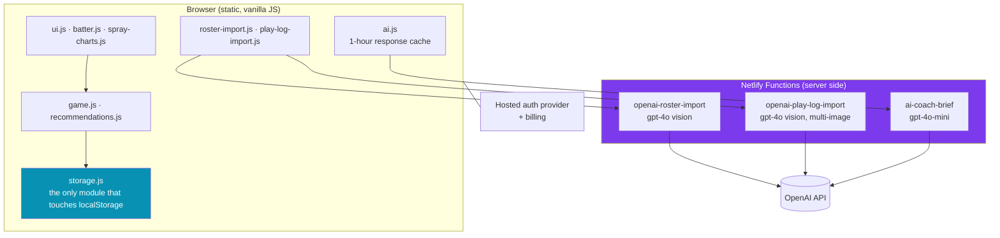

# Defensive Positioning Assistant

**A mobile-first defensive positioning assistant for baseball coaches, used on a phone in a dugout during a live game.**

Static site, vanilla JavaScript, no framework, no backend server. Every model call goes through a serverless function so no key ever reaches the client.

---

## What it does

A coach opens it on their phone between innings. It knows every batter in the opposing lineup, where that batter has actually hit the ball, and it tells the defense where to stand.

1. **Build a roster.** Type it in, or photograph a lineup card and let vision extraction do it.
2. **Chart the game.** Tap the outcome of each plate appearance, and for balls in play, tap where it landed on a field diagram.
3. **Get a recommendation.** The app computes pull tendency, contact tendency, and hot and cold streaks, then outputs fielder movement calls.
4. **Read it out loud.** A short natural-language brief explains the recommendation in one or two sentences the coach can relay verbatim.

Historical data can also be backfilled by uploading screenshots of a play-by-play log from a third-party scorekeeping app, turning a season of already-recorded games into positioning data without re-charting anything by hand.

---

## Architecture



**The core constraint is architectural, not incidental:** this stays a static site on vanilla JavaScript. No framework migration, no backend server, no client-side database. Every privileged operation crosses into a Netlify Function.

That constraint buys three things. The API key is never in the bundle. There is no server to keep patched or pay for at idle. And a coach on a bad cell connection at a rural ballpark loads a handful of static files instead of a framework bundle.

It costs one thing, honestly: a content security policy that still permits `unsafe-inline` for scripts, because the page carries a large number of inline handlers that cannot be removed without a full refactor. That is recorded as a known tradeoff in `DECISIONS.md` rather than quietly ignored, and everything else in the policy is locked down.

---

## The part worth reading: making vision extraction survive its own output

The play-log import is the most technically interesting feature, because it is where a model integration met a real production limit and had to be made to degrade instead of fail.

**The failure.** A coach uploads seven or more screenshots covering a full game. The model reads them correctly. It then has to emit one JSON array containing every play it found. At a 4,000 token completion ceiling, a full game overflowed, the array was cut off mid-object, `JSON.parse` threw, and the user got "Try clearer images."

That error message was a lie. The images were fine. The model's work was fine. The **response envelope** was too small, and the failure surfaced as a content problem, which is the worst kind of bug because it sends the user off to fix something that was never broken.

**Two fixes, and only one of them is interesting.**

The obvious fix was raising the ceiling to 16,000 tokens, just under the model's documented completion cap, to give the array room.

The fix that matters is that **a raised ceiling is still a ceiling.** Somebody will eventually upload twelve screenshots of a fourteen-inning game. So truncation had to stop being fatal:

```js
// Fallback when JSON.parse throws on a truncated array.
// Every object up to the last complete brace is still valid data.
function salvageObjects(str) { /* ... */ }
```

The salvage pass scans the raw string character by character tracking brace depth, correctly skipping braces that appear inside string literals and handling backslash escapes so an escaped quote does not desynchronize the scanner. Every time depth returns to zero it has a complete, balanced top-level object, which it parses individually and keeps. An object that fails to parse is skipped rather than aborting the pass. The dangling incomplete object at the truncation point never returns to depth zero, so it is dropped naturally instead of throwing.

The result: a truncated response returns **the plays that were fully generated before the cutoff**, as a normal success. Hard failure is reserved for the case where nothing at all was recoverable.

The general lesson: when a model's output is structured, the parse boundary is a place where partial success is available for free, and treating it as all-or-nothing throws away work the user already paid for.

### Other reliability measures across the three functions

| Concern | Handling |
|---|---|
| Key exposure | The key exists only in the function environment. The client never sees it. |
| Abuse | Per-IP rate limiting, tuned per endpoint: 30/min for the cheap text brief, 10/min for single-image import, 5/min for multi-image import because those calls are much heavier. |
| Payload size | Per-image cap of roughly 5 MB before base64 overhead, and a hard cap of 12 images per request, both rejected with a specific status rather than a generic 500. |
| Prompt injection | The brief's system prompt instructs the model to treat all supplied context strictly as scouting data and never to follow instructions appearing inside it. Relevant because that context contains user-entered player names. |
| Output injection | Every field returned by the model is HTML-escaped and length-capped before it can reach the DOM. |
| Failure granularity | Distinct status codes for method, rate limit, missing key, bad input, oversized input, upstream failure, and unparseable output. The client can tell the user something true about what went wrong. |
| Cost | Model choice is per-task. The frequently-called text brief uses `gpt-4o-mini`; only vision extraction pays for `gpt-4o`. The brief is cached client-side for an hour. |

**The model never makes the decision.** Positioning is computed by deterministic rules in `recommendations.js`. The model receives the finished recommendation and is instructed not to modify or reinterpret it, only to phrase it. A coach acting on a recommendation during a live game needs it reproducible and explainable, and a model that could quietly disagree with the rules engine would make it neither.

---

## Testing

Vitest for unit and integration, Playwright for end to end. **381 tests across 15 files.**

- **Unit:** recommendation logic, name matching, result-to-marker mapping, location-to-coordinate mapping, deduplication across overlapping screenshot uploads, bunt handling, undo.
- **Integration:** environment and function configuration, auth, billing, each serverless function returning sanitized output and filtering correctly, security headers, rate limiting, storage schema validation.
- **End to end:** smoke, auth, billing signup, each import flow, and a responsive spec asserting the field diagram keeps its aspect ratio and does not clip or scroll across phone widths.

A documented gap, since gaps belong in a README: several end-to-end specs need live network access to a third-party auth CDN and cannot run offline. Environmental rather than a regression, but it does mean part of the suite is not exercised on every run.

```bash
npm install
npx vitest run        # 381 passing
npm run test:e2e      # needs a browser and network
```

---

## A design decision worth stealing

The field diagram is a single inline SVG with a fixed `viewBox="0 0 100 100"`, locked to a square aspect ratio, in the exact coordinate space the app stores hit locations in.

It did not start that way. It started as roughly twenty positioned `div` elements using mixed units, and on real phones the base lines visibly shifted as the viewport changed, which meant the drawn field and the recorded data slowly disagreed with each other. Rebuilding it as one drawing in the data's own coordinate space makes that class of bug **impossible** rather than fixed, which is a meaningfully different guarantee.

The same instinct shows up in the layout rule: the field is sized as the largest square that fits inside a container-query-sized wrapper filling the viewport, with scrolling disabled. A coach holding a phone one-handed between innings should never have to scroll to see the field.

---

## Project layout

```
index.html              single page
js/                     12 modules, explicit load order
netlify/functions/      3 serverless functions, all model calls
specs/                  per-feature specs with acceptance criteria
tests/{unit,integration,e2e}
ARCHITECTURE.md         module responsibilities and what must never change
DECISIONS.md            numbered decisions with reasoning and dates
PLAYBOOK.md             the sequential build plan
TESTING.md              conventions and coverage
```

Built spec-first. The method is documented at [spec-driven-agentic-development](https://github.com/JosephSReyes/spec-driven-agentic-development).

---

## About this repository

This is a commercial product, published here as an engineering reference with the client's written permission. The product name and all identifying data have been removed: no client name, no team names, no player names, no game data.

See [NOTICE](NOTICE) for terms. This is **not** open-source software.
