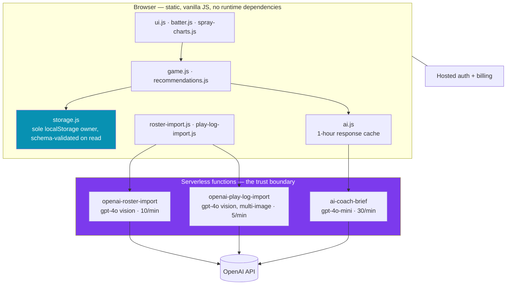

# Defensive Positioning Assistant

**Tells a baseball coach where to move each fielder, computed from where the batter at the plate has actually hit the ball. Runs on a phone, in a dugout, between innings, on rural cell service.**

A production commercial application. Static site, vanilla JavaScript, no framework, no backend server, zero runtime dependencies. Every model call crosses a serverless boundary, so no key ever reaches the client.

**→ [Read the architecture case study](CASE_STUDY.md)** — the problem, the constraints, the decisions and the alternatives rejected, and the measured outcomes.

---

## In one minute

**The problem.** Below the professional level, defensive positioning is guesswork. The data exists — in a coach's memory, or as screenshots in a scorekeeping app — but never in a form usable in the eleven seconds between a batter stepping in and the first pitch. The gap isn't analysis. It's an analysis that arrives fast enough to act on, in language that can be shouted across a field.

**The architecture.** A deterministic rules engine owns every recommendation. A language model is confined to phrasing that recommendation into a sentence the coach can relay verbatim. The model never decides where a fielder stands.

**Why that way.** A recommendation acted on in front of a crowd has to be reproducible and defensible. A model that can quietly disagree with the rules engine makes it neither. And the rules engine renders instantly with no signal, which the ten-second budget requires. [Full reasoning →](CASE_STUDY.md#4-the-decision-that-defines-the-system-the-model-does-not-decide)

**What came out of it.**

| | |
|---|---|
| Automated tests | **381** across 15 files, all passing — ~4,200 test lines against ~3,100 of JavaScript |
| Runtime dependencies | **Zero.** ~300 KB uncompressed for the entire application |
| Secrets reachable from the client | **Zero**, enforced by test rather than by habit |
| Field diagram after two rewrites | 11–18% of screen at 4.8:1 distortion → **46% at a locked 1.00 ratio** |
| Drawing-to-data alignment | Drifted with viewport → **within 1.5 px**, asserted in test |
| Import ceiling | Hard failure at ~7 screenshots → **12, with partial recovery past the model's token limit** |
| Marginal cost per recommendation | **$0.** Only the optional explanation calls a model, and it's cached for an hour. |

Every figure is verifiable from this repository — [how to check them](CASE_STUDY.md#10-verifying-the-claims-in-this-document).

---

## What it does

A coach opens it on their phone between innings. It knows every batter in the opposing lineup, where that batter has actually hit the ball, and it tells the defense where to stand.

1. **Build a roster.** Type it in, or photograph a lineup card and let vision extraction do it.
2. **Chart the game.** Tap the outcome of each plate appearance, and for balls in play, tap where it landed on a field diagram.
3. **Get a recommendation.** The app computes pull tendency, contact tendency, hot and cold streaks, and bunt likelihood, then outputs fielder movement calls — instantly, with no network.
4. **Read it out loud.** An optional one- or two-sentence brief phrases the recommendation so the coach can relay it verbatim.

A season of already-recorded games can be backfilled by uploading screenshots of a play-by-play log from a third-party scorekeeping app, turning existing history into positioning data with no manual charting.

---

## Architecture



**The core constraint is architectural, not incidental:** this stays a static site on vanilla JavaScript. No framework, no backend server, no client-side database. Every privileged operation crosses into a serverless function.

That constraint buys three things. The API key is never in the bundle. There is no server to keep patched or pay for at idle. And a coach on one bar of service at a rural ballpark downloads a handful of static files instead of a framework bundle.

It costs one thing, stated honestly: a content security policy that still permits `unsafe-inline` for scripts, because the page carries sixty-plus inline handlers inherited from the original prototype that cannot be removed without a full refactor. That is [recorded as a known tradeoff](CASE_STUDY.md#54-csp-retains-unsafe-inline-for-scripts) rather than quietly shipped, and everything else in the policy is locked down.

---

## Two problems worth reading about

### Making vision extraction survive its own output

A coach uploads seven screenshots covering a full game. The model reads them correctly. It then has to emit one JSON array containing every play — and at a 4,000-token completion ceiling, a full game overflowed, the array was cut off mid-object, `JSON.parse` threw, and the user got *"Try clearer images."*

That message was a lie. The images were fine. The **response envelope** was too small, and the failure surfaced as a content problem, which sent the user off to fix something that was never broken.

Raising the ceiling to 16,000 tokens resolves the reported case. The fix that matters is that a raised ceiling is still a ceiling — so truncation had to stop being fatal. A brace-depth scanner recovers every complete object that was generated before the cutoff, correctly skipping braces inside string literals and handling escapes, and returns them as a normal success. Hard failure is now reserved for the case where nothing at all was recoverable.

**The lesson:** when a model emits structured output, the parse boundary is where partial success is available for free. Treating it as all-or-nothing throws away work the user already paid for. [Full write-up →](CASE_STUDY.md#7-failure-engineering-making-model-output-degrade-instead-of-break)

### Eliminating a bug class instead of fixing a bug

The field diagram started as twenty positioned `div` elements using three different coordinate conventions at once. They agreed at exactly one aspect ratio; every other phone pulled them apart, and the base lines visibly drifted.

The analysis was never affected — hit locations are stored as normalized 0–100 coordinates and every calculation runs on those numbers. But the diagram the coach *taps on* had drifted away from the coordinate space the data lives in, so **capture was being biased by the device**. A data-integrity bug wearing a CSS bug's clothing.

Correcting the offsets would have produced a drawing that was right until the next layout change. Instead the background was rebuilt as one inline `<svg viewBox="0 0 100 100">` — the same 0–100 space the data is stored in — locked to a square. The drawing and the data can no longer disagree, because they are the same coordinate system. A test asserts it numerically: first base as drawn lands within 1.5 px of where the data overlay puts the same coordinate, at every viewport.

**The lesson:** when a bug comes from two representations of one truth drifting apart, unify the representations. Fixing the drift treats the symptom; removing the second representation makes the class of bug unrepresentable. [Full write-up →](CASE_STUDY.md#6-eliminating-a-bug-class-instead-of-fixing-a-bug)

---

## Reliability and cost

| Concern | Handling |
|---|---|
| Key exposure | The key exists only in the function environment. Tests scan every frontend file to assert it. |
| Abuse | Per-IP rate limits scaled to call cost: 30/min for the cheap text brief, 10/min single-image import, 5/min multi-image import. |
| Payload size | ~5 MB per image before base64 overhead, hard cap of 12 images, rejected with `413` rather than a generic `500`. |
| Prompt injection | The brief's system prompt treats supplied context strictly as scouting data, never as instructions — it contains user-entered player names. |
| Output injection | Every model-returned field is HTML-escaped and length-capped before reaching the DOM. |
| Failure granularity | Seven distinct status codes, so the client can always tell the user something true. |
| Untrusted local state | localStorage is schema-validated on read, with prototype-pollution keys stripped. |
| Cost | Model choice follows task difficulty. Recommendations are free; only the optional brief calls a model, on the cheap model, capped at 150 tokens, cached for an hour. |

---

## Testing

Vitest for unit and integration, Playwright for end to end. **381 tests across 15 files**, roughly 4,200 test lines against 3,100 lines of JavaScript.

- **Unit:** recommendation logic, name matching, result-to-marker mapping, coordinate mapping, deduplication across overlapping screenshot uploads, bunt handling, undo scoping.
- **Integration:** environment and function configuration, auth, billing, each function's sanitized output and filtering, security headers, rate limiting, storage schema validation.
- **End to end:** smoke, auth, billing signup, each import flow, and a responsive spec asserting the field keeps its aspect ratio and neither clips nor scrolls across six phone sizes.

```bash
npm install
npx vitest run        # 381 passing
npm run test:e2e      # needs a browser and network
```

A documented gap, since gaps belong in a README: several end-to-end specs reach protected screens through a third-party auth CDN and need network access. They fail offline by redirecting to the landing screen — environmental rather than a regression. `field-responsive.spec.js` deliberately avoids the dependency and runs anywhere.

---

## Project layout

```
index.html              single page
js/                     12 modules, explicit load order
netlify/functions/      3 serverless functions, all model calls
specs/                  per-feature specs with acceptance criteria
tests/{unit,integration,e2e}
CASE_STUDY.md           problem, constraints, decisions, outcomes
ARCHITECTURE.md         module responsibilities and what must never change
DECISIONS.md            numbered decisions with reasoning and dates
PLAYBOOK.md             the sequential build plan
TESTING.md              conventions and coverage
```

Built spec-first: each feature has a numbered spec with acceptance criteria written before implementation, and decisions are recorded with their reasoning at the time. The method is documented at [spec-driven-agentic-development](https://github.com/JosephSReyes/spec-driven-agentic-development).

---

## About this repository

This is a commercial product, published here as an engineering reference with the client's written permission. The product name and all identifying data have been removed: no client name, no team names, no player names, no game data.

See [NOTICE](NOTICE) for terms. This is **not** open-source software.
